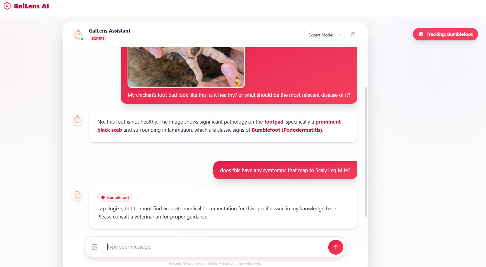
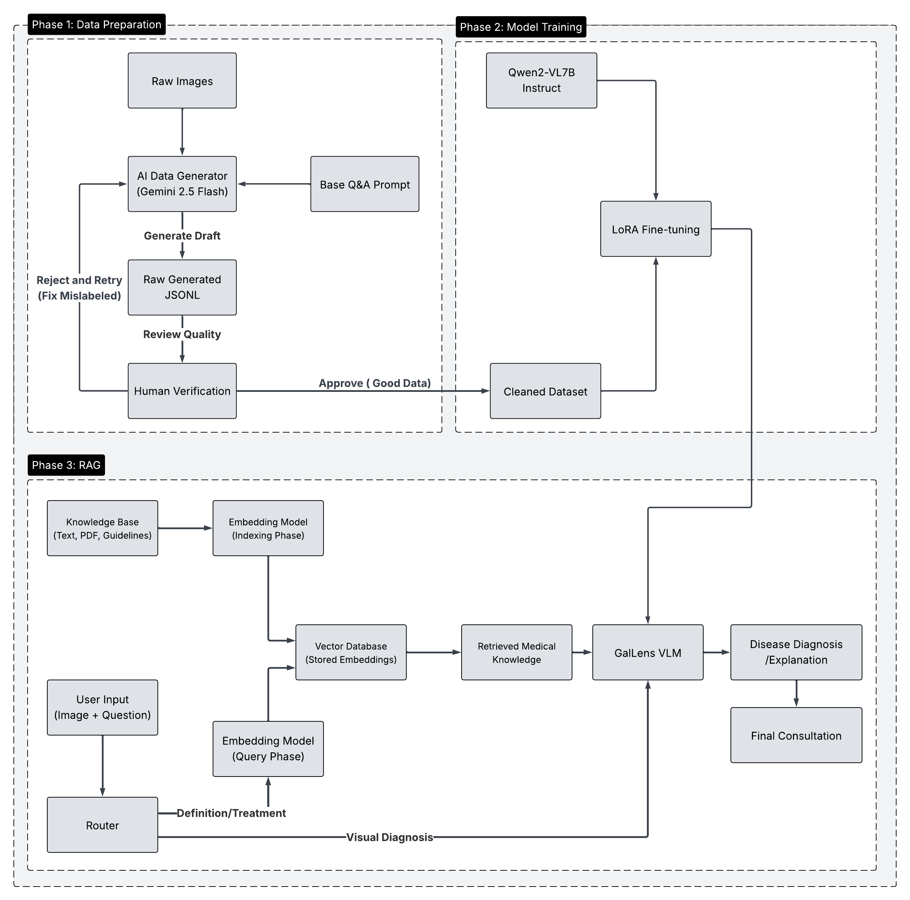

# 🐔 GalLens (Gallus + Google lens) — Vision–Language System for Poultry Disease Diagnosis & Explanation  

GalLens is a **Vision–Language-based system** for **chicken disease diagnosis and explanation**, designed to support **non-expert poultry farmers**.

Unlike standard CNN classifiers that only output a label, GalLens:
- **Understands images** (Vision)
- **Understands language** (LLM)
- **Reasons with medical knowledge via RAG**
- Provides **human-readable explanations + treatment guidance** grounded in real veterinary documents.

---

## Core Goals

GalLens answers two key questions:

1. **What disease does this chicken have?** → *Visual diagnosis*  
2. **Why and what should I do?** → *Grounded explanation + treatment via RAG*

---
## DEMO

## Full Workflow 

### High-level pipeline

1. **User input:** Image + Question  
2. **Router decides mode:**
   - If **diagnosis** → use fine-tuned VLM  
   - If **treatment / medical question** → activate RAG + VLM  
3. **If RAG is used:**
   - Retrieve relevant veterinary documents  
   - Inject knowledge into the model prompt  
4. **Final output:**
   - Disease label  
   - Natural-language explanation grounded in evidence  

---

## Two Inference Modes

### Visual Diagnosis Mode  
**Input:**  
- Chicken image  
- Question: *“What disease is this?”*

**Output:**  
- Predicted disease  
- Visual symptom explanation  

### 🔹 Medical Consultation Mode  
**Input:**  
- Text question like *“How to treat Newcastle disease?”*

**Output:**  
- Retrieved medical evidence  
- Grounded, safe explanation  

---

## Model Fine-Tuning

### Base model  
- **Qwen2-VL-7B Instruct**

### Fine-tuning method  
- **LoRA (Low-Rank Adaptation)**

---

## Retrieval-Augmented Generation (RAG)

### Knowledge sources
- Veterinary manuals  
- Medical guidelines  
- Research papers  
- PDF documents  
- Trusted agriculture websites  

### Vector database
- **ChromaDB**

---

## Core Packages

The whole project relies on:

torch
transformers
peft
accelerate
bitsandbytes
faiss-cpu
chromadb
sentence-transformers
pandas
numpy
tqdm
pillow
fastapi
uvicorn

---

